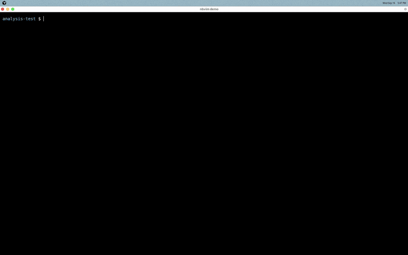

# nbvim

Vim-inspired terminal UI for editing and running Jupyter `.ipynb` notebooks.

Open or create a notebook, move between cells with vim-like keys, and run Python in your active environment.



## Demo

A short Kitty recording against the [analysis-test](https://github.com/arthuralbarelli/analysis-test) QA notebook: opening the notebook, navigating past a markdown table, running cells with `r` through a persistent kernel, a pandas table, and a matplotlib chart rendered with the Kitty graphics protocol.

[Download the MP4](assets/nbvim-demo.mp4)

## Requirements

- Python 3.13+
- [pipx](https://pipx.pypa.io/) to install the app, or [uv](https://docs.astral.sh/uv/) to develop it

## Install

```bash
pipx install nbvim
nbvim path/to/notebook.ipynb
```

Upgrade:

```bash
pipx upgrade nbvim
```

Until the package is on PyPI, or to install from git:

```bash
pipx install git+https://github.com/arthuralbarelli/nbvim.git
pipx upgrade nbvim
```

A specific tag:

```bash
pipx install git+https://github.com/arthuralbarelli/nbvim.git@v0.1.0
```

### Development

```bash
uv sync
uv run nbvim path/to/notebook.ipynb
```

If the path does not exist, nbvim creates a new notebook there before the UI starts.

## Keybindings

Bindings apply in navigation mode unless noted.

| Key | Action |
| --- | --- |
| `j` / `k` | Next / previous cell |
| `a` / `b` | Add cell above / after |
| `c` | Copy the focused cell |
| `v` | Paste the copied cell below |
| `dd` | Delete cell (press `d` twice) |
| `Enter` | Edit cell (starts in Insert) |
| `Esc` | Insert → Normal; Normal → navigation |
| `r` | Run the focused code cell and go to the next cell |
| `R` | Run the focused code cell and stay |
| `m` | Switch cell between markdown and Python |
| `:` | Open the command bar |

`r` on the last cell inserts a new code cell below and focuses it. A failed run stays on the current cell. On markdown, `r` / `R` skip the kernel: `r` still advances, `R` stays.

### Edit mode

The cell editor uses vim Insert, Normal, and Visual modes.

| Key | Action |
| --- | --- |
| `i` / `a` | Insert at cursor / after cursor |
| `h` `j` `k` `l` | Move (extend the selection in Visual) |
| `0` / `$` | Line start / end |
| `x` | Delete the character under the cursor |
| `dd` / `cc` / `yy` | Delete / change / yank the current line |
| `p` | Paste the in-cell register |
| `u` | Undo |
| `v` / `V` | Character / line Visual |

In Visual, `d`/`x` delete the selection, `y` yanks it, and `c` deletes it and enters Insert.

## Commands

| Command | Action |
| --- | --- |
| `:w` | Save |
| `:q` | Quit without saving |
| `:wq` | Save and quit |
| `:q!` | Quit without saving |

Leaving the UI any other way saves the notebook automatically.

## Kernel

`r` executes the focused code cell in a persistent Jupyter Python kernel.

The kernel uses the interpreter from `--python`, or else the active environment (`VIRTUAL_ENV`, then `CONDA_PREFIX`). It never uses the interpreter running nbvim, and it does not guess a project `.venv`. If nothing is active, the editor still opens and running a cell reports an error.

PNG, JPEG, GIF, and WebP display outputs are rendered with the terminal's
native graphics protocol when available (Kitty TGP or Sixel). Terminals without
those protocols fall back to colored Unicode blocks. Images fill the available
output width. matplotlib figures are captured at retina resolution.

Try the included demo with:

```bash
uv run nbvim demo.ipynb
```

The target environment needs `ipykernel` installed.

```bash
source .venv/bin/activate
nbvim path/to/notebook.ipynb

nbvim --python /path/to/python path/to/notebook.ipynb
```

## Develop

```bash
make format   # Black
make lint     # Black --check
```

## Release

Do not bump `version` in `pyproject.toml` for a release. After this workflow is on `master`, tag `vX.Y.Z` and push the tag; CI publishes that version to PyPI.

```bash
git checkout master
git pull
git tag -a v0.1.0 -m v0.1.0
git push origin v0.1.0
```

`.github/workflows/publish.yml` runs on `v*` tags. It sets the package version from the tag (`v0.1.0` → `0.1.0`) with `uv version`, then `uv build`, then publishes with PyPI trusted publishing (OIDC). No PyPI token is stored in the repo.

The `version` field in `pyproject.toml` is only a local default. The first release is `0.1.0`. Later tags such as `v0.2.0` do not need a matching commit that edits `pyproject.toml`.

### One-time PyPI trusted publisher

Do this once, then merge the publish workflow, then push `v0.1.0`.

1. **GitHub environment** named `pypi` (no secrets): [Settings → Environments → New environment](https://github.com/arthuralbarelli/nbvim/settings/environments)
2. **PyPI pending publisher** at [https://pypi.org/manage/account/publishing/](https://pypi.org/manage/account/publishing/) (the `nbvim` project does not exist yet):
   - PyPI project name: `nbvim`
   - Owner: `arthuralbarelli`
   - Repository name: `nbvim`
   - Workflow name: `publish.yml`
   - Environment name: `pypi`

The first successful upload creates https://pypi.org/project/nbvim/ .
